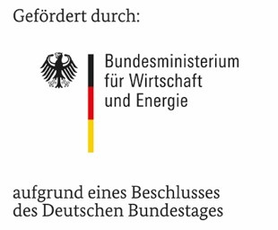

# TSDBBench

TSDBBench is a benchmaring framework to measure the performance of time series databases (TSDBs). It constists of following components:

- [YCSB-TS](http://tsdbbench.github.io/YCSB-TS/) - a fork of [YCSB](https://github.com/brianfrankcooper/YCSB) that is adopted to use basic time domain functions and support timestamps and timeranges.
- [Overlord](http://tsdbbench.github.io/Overlord/) - takes care about the installation of the databases and the execution of the benchmark.

Additional information:

- [List of supported databases](http://tsdbbench.github.io/Overlord/#supported-databases)
- [Comparision of all available Open Source Time Series Databases](https://tsdbbench.github.io/Ultimate-TSDB-Comparison/) - an [ultimate comparison](http://ultimate-comparisons.github.io/).
* [TSDBBench Box at atlas](https://atlas.hashicorp.com/TSDBBench/boxes/tsdbbench_dummy.box)

Full documentation of TSDDBench is available at <https://tsdbbench.github.io/Overlord/>.

## Scientific Work

* [Survey and Comparison of Open Source TSDBs](http://btw2017.informatik.uni-stuttgart.de/slidesandpapers/E4-14-109/paper_web.pdf) [[slides]](http://btw2017.informatik.uni-stuttgart.de/slidesandpapers/E4-14-109/slides.pdf)
* [Comparison of TSDBs](http://www2.informatik.uni-stuttgart.de/cgi-bin/NCSTRL/NCSTRL_view.pl?id=DIP-3729&mod=0&engl=0&inst=FAK)

## Related Work

* [BenchFoundry](https://github.com/dbermbach/BenchFoundry)
* [YCSB-TS](https://github.com/TSDBBench/YCSB-TS)

## Funding

TSDBBench received funding from the
[Federal Ministry for Economic Affairs and Energy](http://www.bmwi.de/Navigation/EN/Home/home.html)
in the context of the project [NEMAR](https://www.nemar.de/).

## Impress

See <https://www.uni-stuttgart.de/impressum/>.
